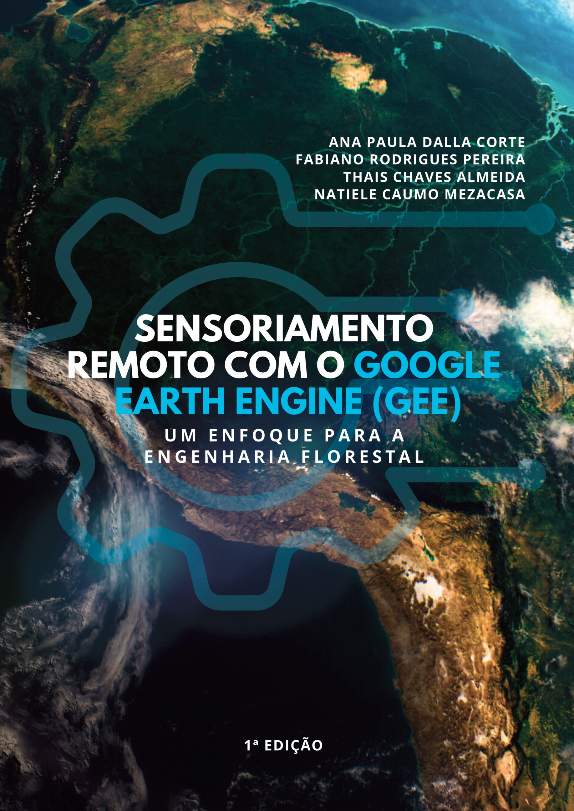
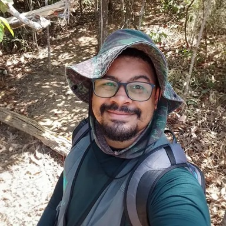
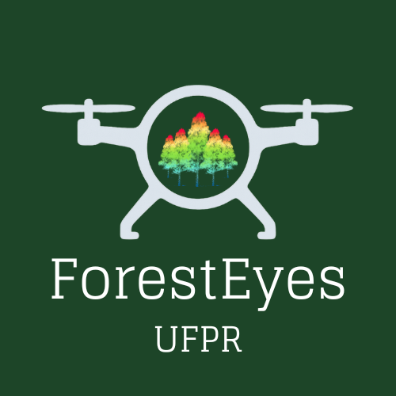

# SENSORIAMENTO REMOTO COM O GOOGLE EARTH ENGINE (GEE): UM ENFOQUE PARA A ENGENHARIA FLORESTAL

  

  

## 📘 Sobre o livro

O livro “Sensoriamento Remoto com o Google Earth Engine (GEE): um enfoque para a Engenharia Florestal” foi confeccionado com o objetivo de oferecer aos alunos e profissionais da área uma literatura prática e acessível, permitindo que aprendam a utilizar a plataforma de forma tutorada, passo a passo.

> **Licença de uso:** O livro possui uso gratuito para atividades não comerciais. Qualquer uso comercial (total ou parcial) deve ser previamente consultado e autorizado pelos autores.

---

## 🔗 Contatos e Redes do Grupo ForestEyes

  
  
  
  

---

## 📚 Sumário do Livro

1. **Acesso ao material para os exercícios guiados**
2. **Acesso ao GEE e sua interface**
3. **Tasseled Cap**
4. **Composição de imagens, manipulação de histograma e cálculo de índices de vegetação**
5. **Elaboração de mapas de mudanças temporais (detecção de mudanças)**
6. **Classificação de uso do solo com sensores ópticos e SAR (Synthetic-aperture radar)**
7. **Classificação de uso do solo com Satellite Embedding Dataset**
8. **Análise de séries temporais dos índices de vegetação**
9. **Avaliação da área com foco de incêndio e análise da precipitação**
10. **Detecção de mudanças com SAR**
11. **Análise de APP por declividade com SRTM**
12. **Áreas urbanas arborizadas**
13. **Uso da Coleção MapBiomas**
14. **Upscaling GEDI**
15. **Referências bibliográficas**

---

## ✉️ Receba o livro

Para receber uma cópia diretamente da equipe, preencha o formulário oficial:
👉 **[https://forms.gle/FqvcdSdScFBnQxXD7](https://forms.gle/FqvcdSdScFBnQxXD7)**

Pedimos a gentileza de **não compartilhar o arquivo diretamente**. Caso alguém tenha interesse, encaminhe o link do formulário.

---

## 👥 Autores

  <table>
    <tr>
      <td align="center" style="padding:20px">
         
        <strong>Ana Paula Dalla Corte</strong> 
        <a href="mailto:anapaulacorte@gmail.com">anapaulacorte@gmail.com</a>
      </td>
      <td align="center" style="padding:20px">
         
        <strong>Fabiano Rodrigues Pereira</strong> 
        <a href="mailto:fabianoengflo@gmail.com">fabiano.engflo@gmail.com</a>
      </td>
      <td align="center" style="padding:20px">
         
        <strong>Thaís Chaves Almeida</strong> 
        <a href="mailto:florestal.thais@gmail.com">florestal.thais@gmail.com</a>
      </td>
      <td align="center" style="padding:20px">
         
        <strong>Natiele Caumo Mezacasa</strong> 
        <a href="mailto:natiele.cmz99@gmail.com">natiele.cmz99@gmail.com</a>
      </td>
    </tr>
  </table>

---

## 📚 Outras Publicações

Acesse outros livros do grupo ForestEyes: 👉 [https://gpforesteyes.github.io/books/](https://gpforesteyes.github.io/books/)

---

  

<em>Obrigado por apoiar a ciência aberta e a educação florestal! 🌳</em>

